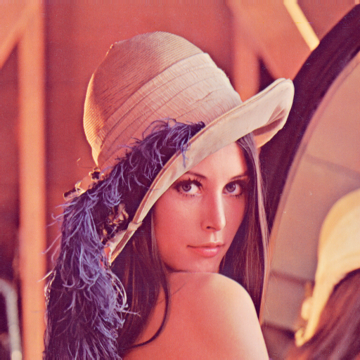
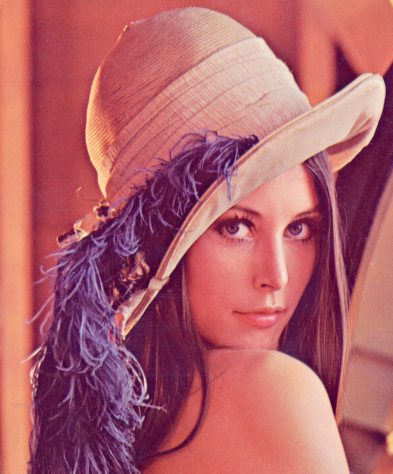

# Обработка изображения в формате PNM

Программа обрабатывает PNM изображения формата P5 (grayscale) и P6 (цветные)

Запуск программы:  
`CompGeomGraphics <input file name> <output file name> <command>`

Команды:
* 0 - инвертировать цвета
* 1 - отразить по горизонтали
* 2 - отразить по вертикали
* 3 - повернуть на 90 градусов по часовой стрелке
* 4 - повернуть на 90 градусов против часовой стрелки

Пример:  
`CompGeomGraphics Lenna.ppm output.ppm 0`

## Примеры обработки
1. Исходное изображение:  
  
Инверсия:  

2. Исходное изображение:  
  
Отражение по вертикали:  

3. Исходное изображение:  
  
Поворот по часовой стрелке:  

