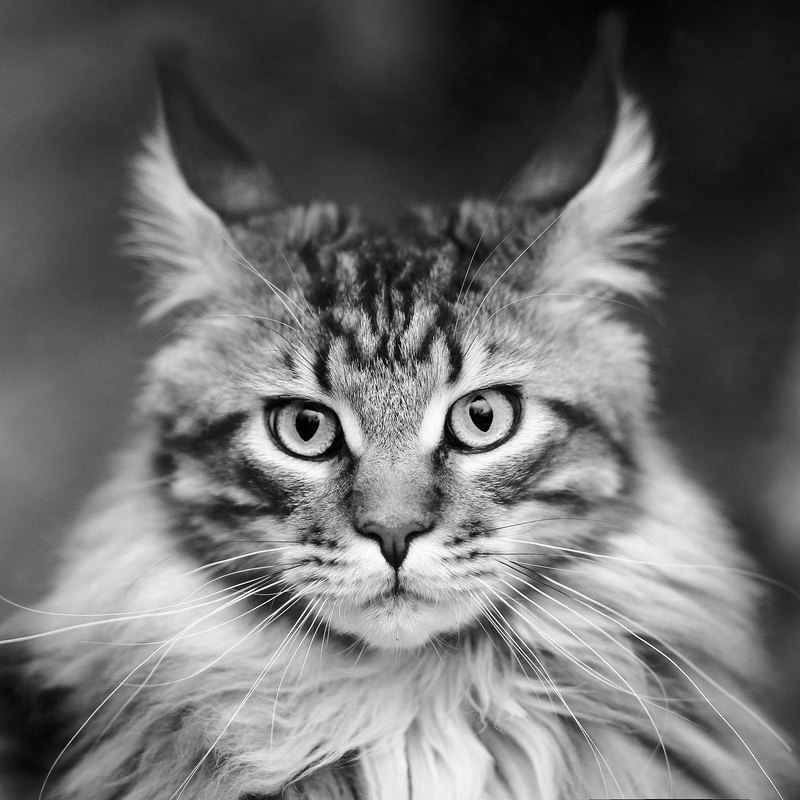
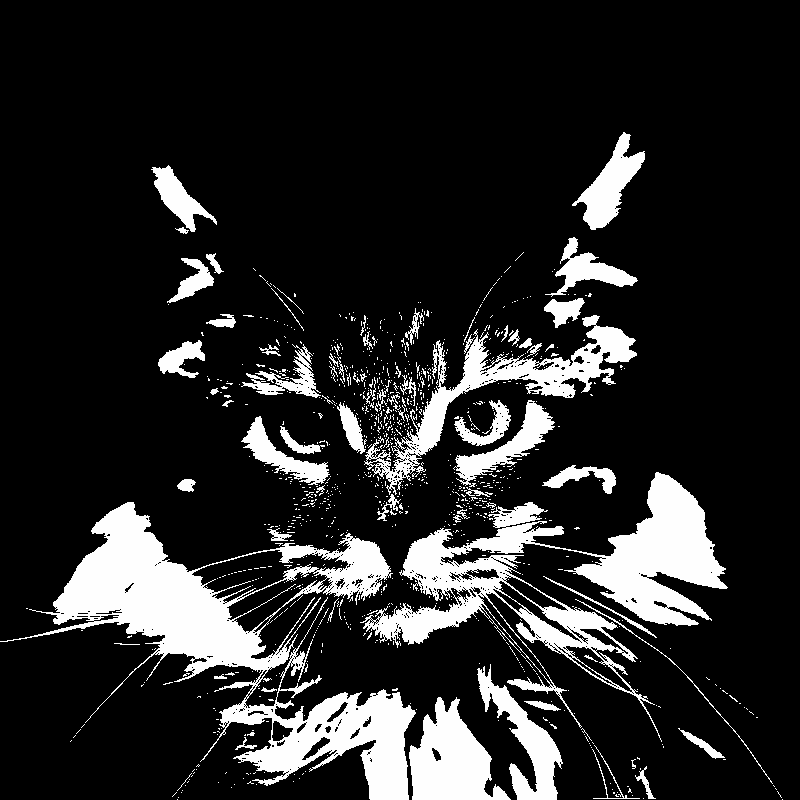
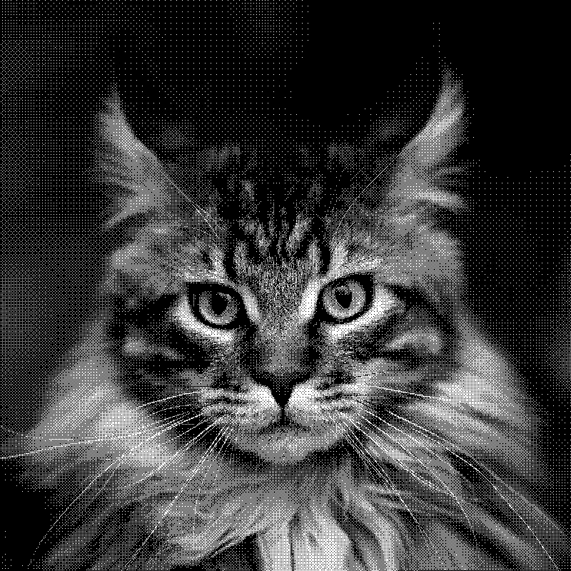
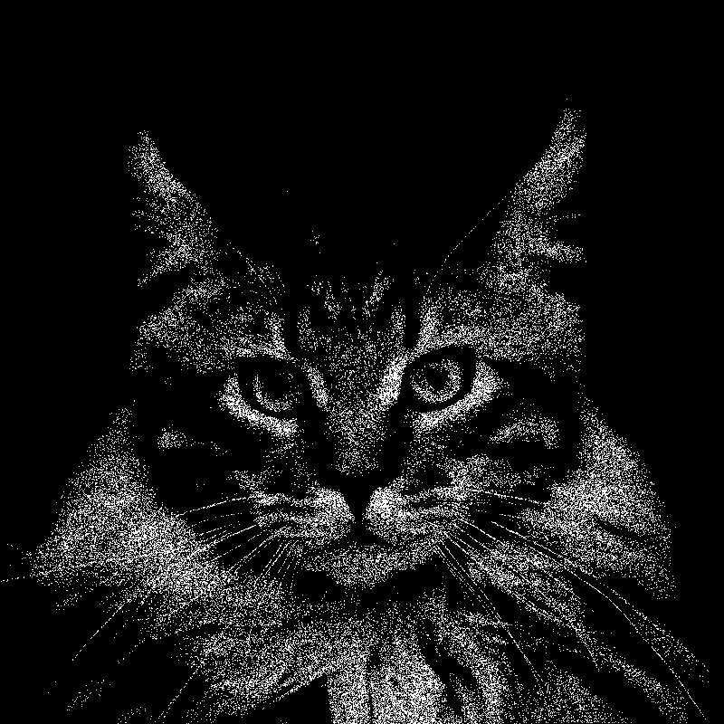
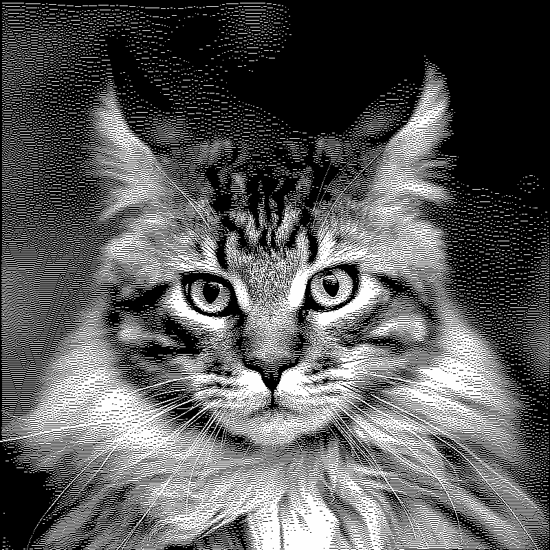
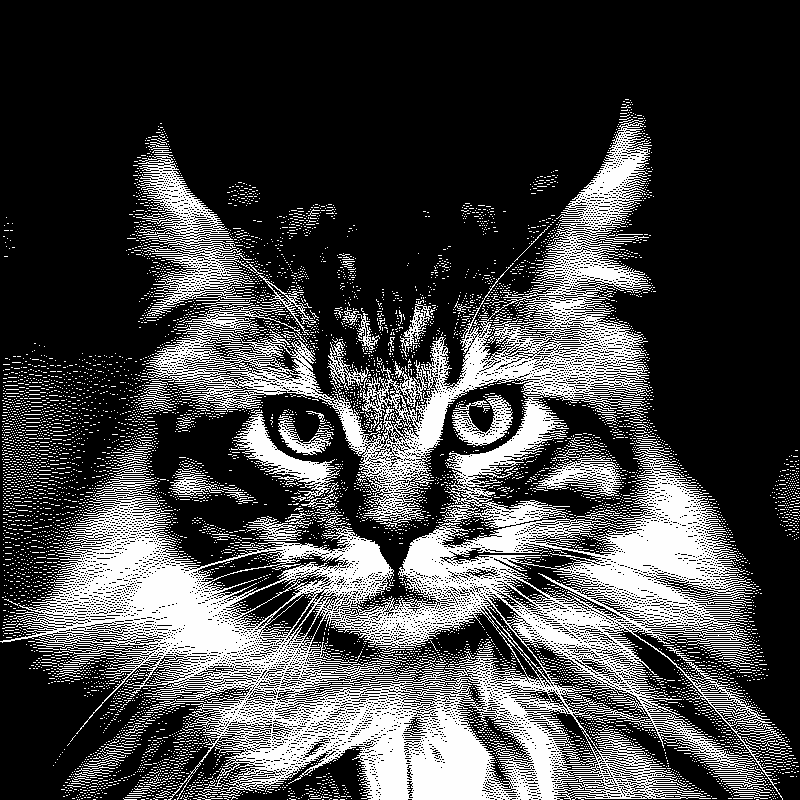
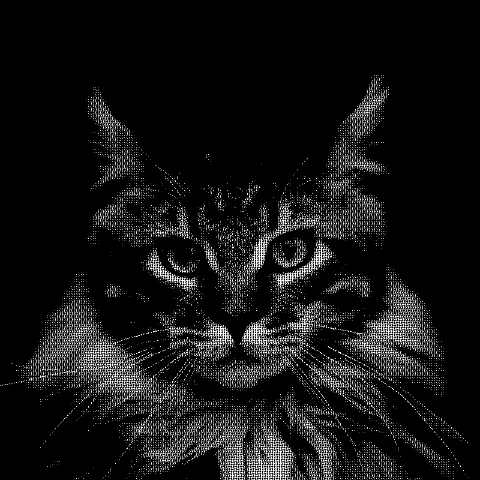

# Лабораторная работа 3: Изучение алгоритмов псевдотонирования изображений

**Цель работы**: изучить алгоритмы и реализовать программу, применяющий алгоритм дизеринга к изображению в формате PGM (P5) с учетом гамма-коррекции.

**Описание**:
Программа должна быть написана на C/C++ и не использовать внешние библиотеки.

Аргументы передаются через командную строку:
`program.exe <имя_входного_файла> <имя_выходного_файла> <градиент> <дизеринг> <битность> <гамма>`,  
где
`<имя_входного_файла>`, `<имя_выходного_файла>`: формат файлов: PGM P5; ширина и высота берутся из <имя_входного_файла>;

`<градиент>`:
* 0 - используем входную картинку,
* 1 - рисуем горизонтальный градиент (0-255) (ширина и высота берутся из <имя_входного_файла>);

`<дизеринг>` - алгоритм дизеринга:
* 0 – Нет дизеринга;
* 1 – Ordered (8x8);
* 2 – Random;
* 3 – Floyd–Steinberg;
* 4 – Jarvis, Judice, Ninke;
* 5 - Sierra (Sierra-3);
* 6 - Atkinson;
* 7 - Halftone (4x4, orthogonal);
`<битность>` - битность результата дизеринга (1..8);
`<гамма>`: 0 - sRGB гамма, иначе - обычная гамма с указанным значением.

## Примеры

Исходное изображение:

Преобразование в 1-битную палитру (ч/б)

0 - без дизеринга

1 - Ordered (8x8)

2 - Random

3 - Floyd-Steinberg

4 - Jarvis, Judice, Ninke

5 - Sierra (Sierra-3)

6 - Atkinson

7 - Halftone (4x4, orthogonal)

